# GLEH - Gammons Landing Educational Hub

[](https://github.com/allie-rae-devop/GLEH/releases)
[](https://www.docker.com/)
[](LICENSE)
[](https://www.python.org/)

Public demo: https://portfollio.gammonslanding.com/

---

## Why this exists

I had a pile of Packt courses and technical textbooks sitting in folders on a server, and no good way to actually work through any of it. Nothing off the shelf fit. Ebook tools handled textbooks but not video courses. So I built the thing I wanted.

I am not a coder. What I know is systems and structure, so I designed it the way I would design any other stack I run: Docker, containers, a reverse proxy, a database, and clear boundaries between the pieces. Claude Code stitched the actual application together the way I specified. The result is one place that holds courses and books together, tracks what I have finished, and runs entirely on hardware I control.

It grew well past the original plan, which was a script that would scan a folder and make a list.

---

## How this was built

This application was written with Claude Code (Anthropic) doing the implementation work. I did the architecture, the container and networking design, the deployment, and the debugging, and I directed every decision about how the thing should be put together. The code itself came out of that collaboration.

I am disclosing that because I think disclosure of AI assistance should be standard practice, including when it is inconvenient and including when nobody would know otherwise. If you are evaluating this project, you should know what you are looking at.

---

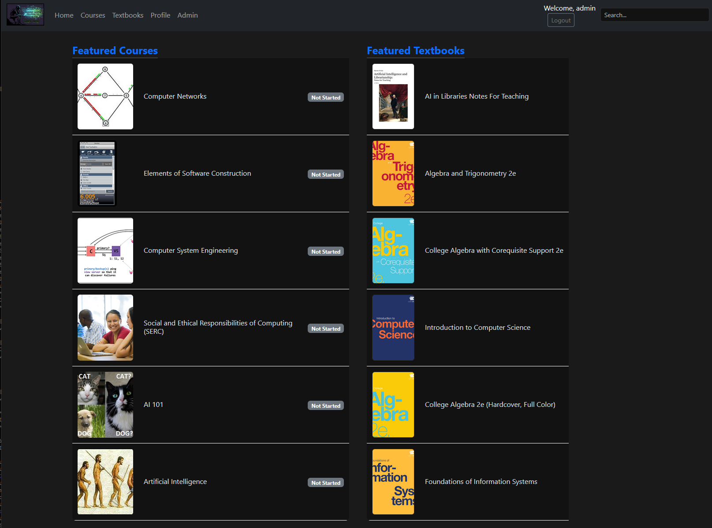

---

## Content and licensing

The public demo serves openly licensed material: MIT OpenCourseWare and Creative Commons textbooks. That content is there as a placeholder so people can see how the application works.

My own library is a different matter. The Packt courses and textbooks I bought are copyrighted, and a license to use something is not a license to redistribute it. That material lives on a separate internal instance on my LAN and never touches the public one.

The split is deliberate and it shaped the design. Guest access, the separation between public and internal instances, and the way content gets loaded all exist because the legal question came first and the architecture followed. If you deploy this, the same reasoning applies to you. Serve what you have the right to serve.

---

## About GLEH

GLEH is a self-hosted learning management system for individuals and small groups who want their educational content on their own hardware. It combines course management, an ebook library, and progress tracking into one Docker stack.

### Course management

- Video-based courses with module structure, no limit on how many
- Automatic course scanning and thumbnail generation
- Progress tracking with completion percentages
- Note-taking during video playback
- Admin panel for upload, organization, and deletion

### Ebook library

- Calibre and Calibre-Web integration over an OPDS feed
- EPUB, PDF, MOBI, and the other formats Calibre handles
- Built-in EPUB reader that remembers where you left off
- Cover images with automatic thumbnail generation
- Guest access, so a public instance can offer book browsing without accounts

### User management

- Role-based access control for admin and student accounts
- Individual profiles with learning history
- Bookmarks and course enrollment tracking
- Single sign-on with Calibre-Web
- Batch user creation for classroom-sized groups

### Administration panel

- Five tabs: Dashboard, Courses, Users, Diagnostics, About
- System health monitoring
- Log viewer with filtering
- Environment variable editor
- Self-healing diagnostics for the problems that come up most
- WYSIWYG editor for the About page

### Infrastructure

- Docker Compose orchestration across five containerized services
- Nginx reverse proxy with rate limiting
- PostgreSQL with automated backups
- Health checks and automatic container restart policies
- Resource limits and network isolation

---

## Credits

**MIT OpenCourseWare:** The public demo serves content from [MIT OpenCourseWare](https://ocw.mit.edu/), which publishes virtually all MIT course material openly and permanently. Their commitment to open education is what makes a public instance of this possible at all.

**Calibre and Calibre-Web:** Ebook management is handled by [Calibre](https://calibre-ebook.com/) and [Calibre-Web](https://github.com/janw/calibre-web).

---

## Installation

### Prerequisites

- Docker and Docker Compose. [Install Docker](https://docs.docker.com/get-docker/)
- 2 CPU cores, 4GB RAM, 20GB disk space as a minimum
- Linux, macOS, Windows with WSL2, or Raspberry Pi OS

### 1. Clone the repository

```bash
git clone https://github.com/allie-rae-devop/GLEH
cd GLEH/
```

### 2. Configure the environment

```bash
cp docker/.env.template docker/.env
nano docker/.env
```

Variables you need to change before starting:

- `SECRET_KEY` - a random secret key for Flask sessions
- `POSTGRES_PASSWORD` - a strong database password
- `CALIBRE_PASSWORD` - the password for Calibre Desktop access

### 3. Generate SSL certificates

Required for Calibre Desktop over HTTPS.

```bash
cd docker/nginx
bash generate_ssl.sh
cd ..
```

This creates self-signed certificates, so your browser will warn you. Click Advanced and accept the risk to continue.

### 4. Start the stack

Run this from the `docker/` directory.

```bash
docker compose up -d
```

Five services come up:

- `edu-web` - Flask application server
- `edu-postgres` - PostgreSQL database
- `edu-nginx` - Nginx reverse proxy
- `edu-calibre` - Calibre Desktop for ebook management
- `edu-calibre-web` - Calibre-Web, the web interface for the library

### 5. Initialize the database

```bash
# Wait until the services report healthy
docker compose ps

# Initialize the database and create the admin user
docker exec edu-web python scripts/init_database.py
```

### 6. Upload your content

#### 6.1 Get files onto the server

Use whatever FTP or SFTP client you like (FileZilla, WinSCP) to move content up.

```bash
cd ~
mkdir -p upload/courses/
mkdir -p upload/books/
cd upload/
```

Course material goes in `~/upload/courses/` and ebooks go in `~/upload/books/`.

#### 6.2 Copy courses into the Docker volume

```bash
docker cp courses/. edu-web:/app/data/courses/
```

Then log into the admin panel at `http://YOUR_IP:3080/admin`, open the Courses tab, and click Scan Courses followed by Generate Thumbnails.

#### 6.3 Import ebooks into Calibre

Calibre keeps its own database, so books have to come in through Calibre Desktop rather than being dropped into a folder.

```bash
# Create the ingress folder
docker exec edu-calibre mkdir -p /config/ingress

# Copy books into it
docker cp books/. edu-calibre:/config/ingress/
```

Then open Calibre Desktop at `https://YOUR_IP:3443` and log in (username `abc`, password from your `.env`). Click Add Books, navigate up two directories, choose `/config/ingress`, select everything, and import. Calibre organizes the files and updates its database on its own.

### 7. Access the application

- Main app: `http://YOUR_IP:3080`
- Admin panel: `http://YOUR_IP:3080/admin`
- Calibre Desktop: `https://YOUR_IP:3443` (username `abc`, password from `.env`)
- Calibre-Web: `http://YOUR_IP:8083`

Default admin login is `admin` / `admin123`. **Change this immediately after your first login.**

**On Calibre Desktop access:** use `https://YOUR_IP:3443`, which goes through the Nginx SSL proxy. Port 8080 will throw an "HTTPS required" error. It exists for internal Docker networking only.

### 8. Configure Calibre-Web

This step is not optional. Without it, SSO and guest access will not work.

1. Open Calibre-Web at `http://YOUR_IP:8083`.

2. Log in with `admin` / `admin123`, then change that password.

3. Click your username in the top right and choose Admin.

4. **Enable reverse proxy authentication.** Under Basic Configuration, Feature Configuration, find Reverse Proxy Authentication and set the header name to `X-Remote-User`. Save.

5. **Enable guest access.** In the same section, turn on Anonymous Browsing. Save.

6. **Set guest permissions.** Under Edit Users, select the Guest user and enable Allow Browse, Allow Read Books, Allow Download, and Show Detail Random. Save.

7. **Enable the reader.** Back in Feature Configuration, turn on E-Book Viewer and E-Book Conversion. Save.

8. **Point at the library.** Under Database Configuration, set the database path to `/books/metadata.db`. Save and restart when prompted.

9. **Check it worked.** Load the GLEH homepage at `http://YOUR_IP:3080`. You should see featured textbooks with cover images, and clicking Launch Book should open the reader without asking a guest to log in.

---

## Troubleshooting

The full guide is in [docker/DOCKER_DEPLOYMENT.md](docker/DOCKER_DEPLOYMENT.md). It exists because I wrote down every problem I ran into getting this deployed, and most of them will come up for you too.

Quick checks:

```bash
# Service status
docker compose ps

# Logs
docker logs edu-web -f
docker logs edu-nginx -f

# Database not initialized
docker exec edu-web python scripts/init_database.py

# Containers will not start
docker compose down
docker compose up -d
```

---

## Gallery

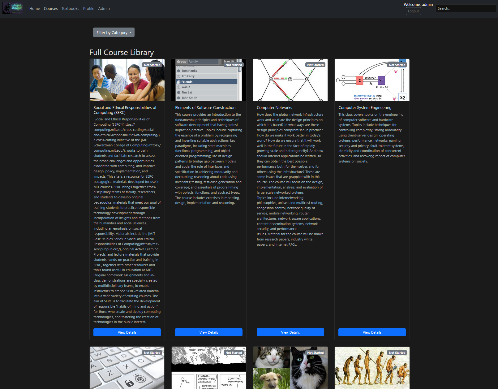

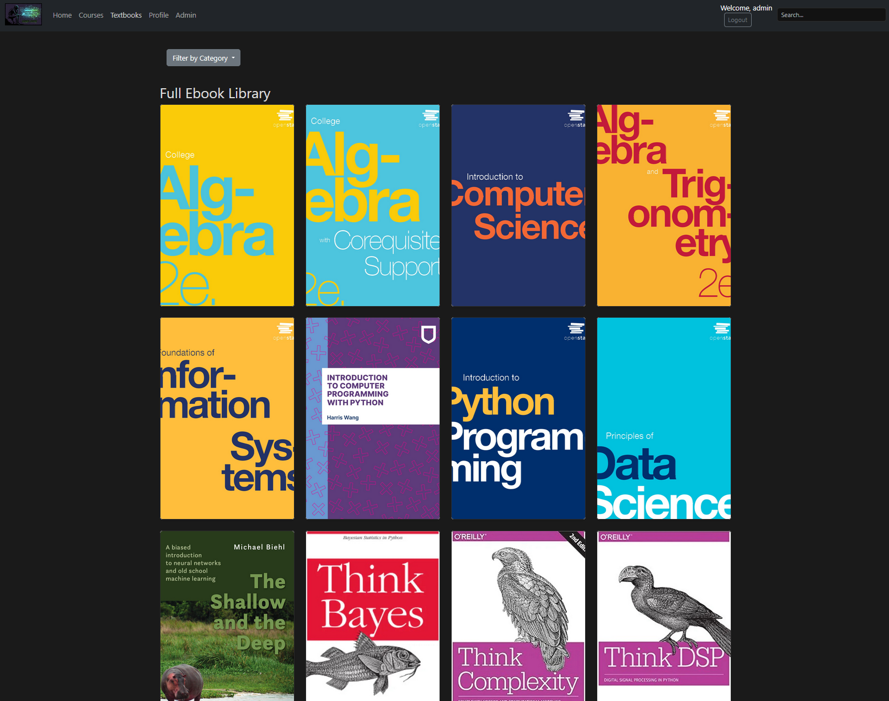

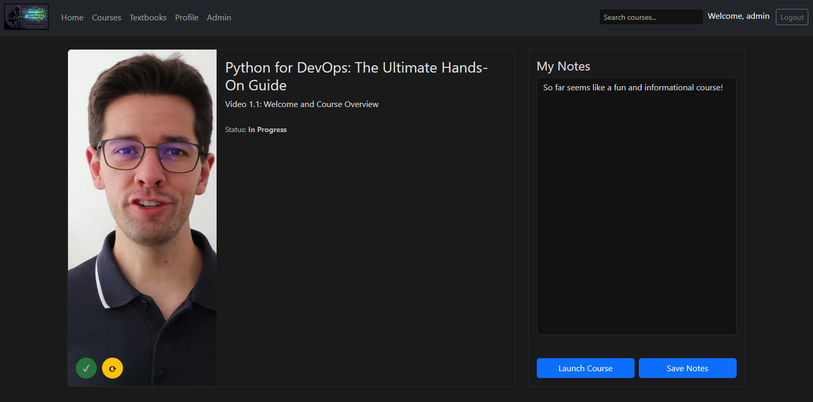

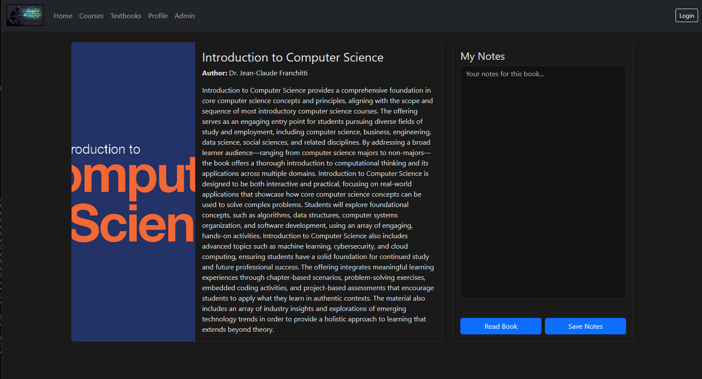

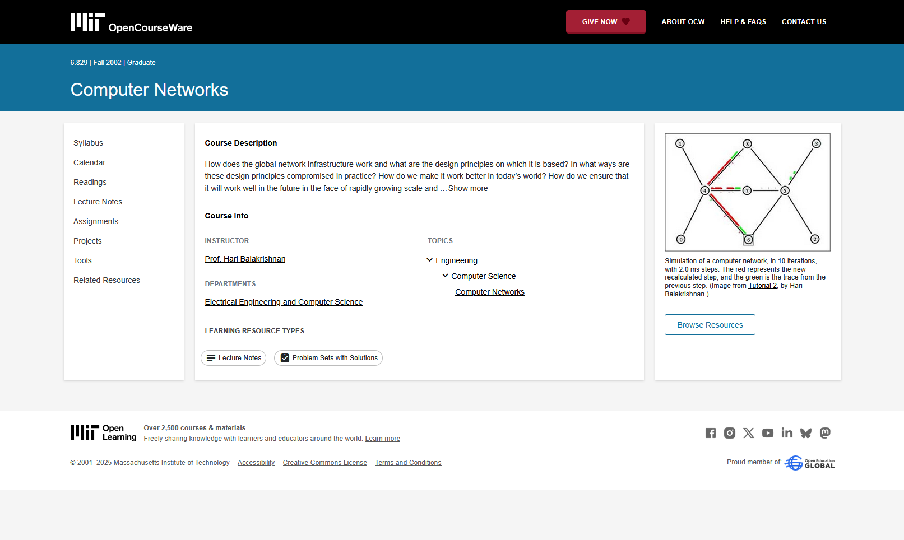

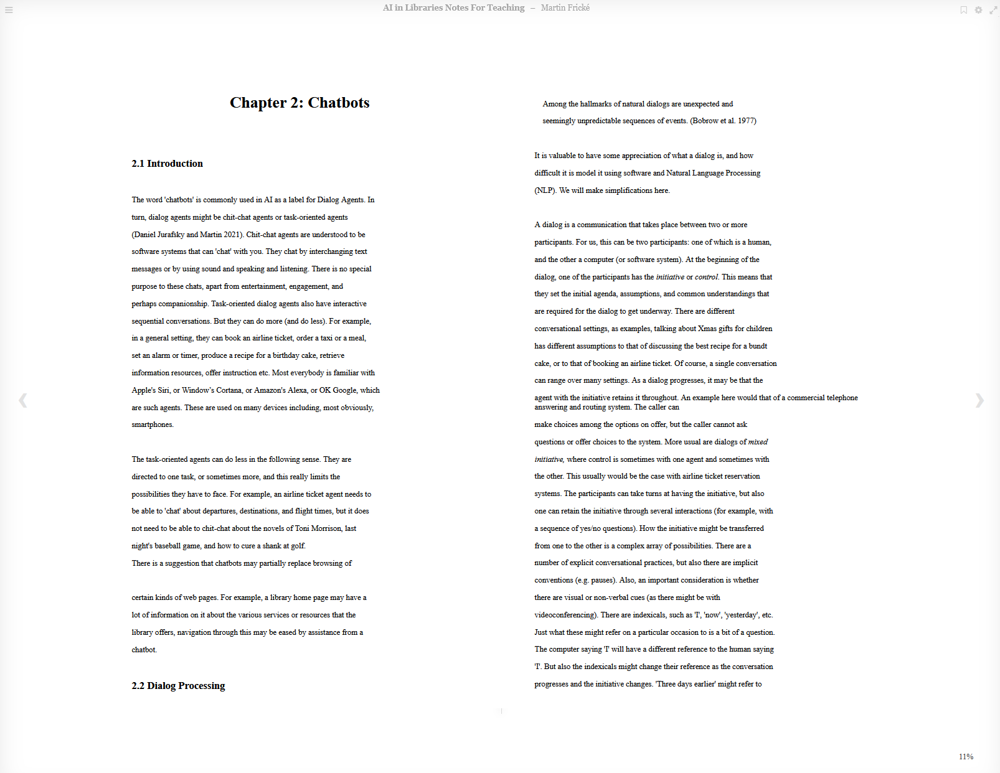

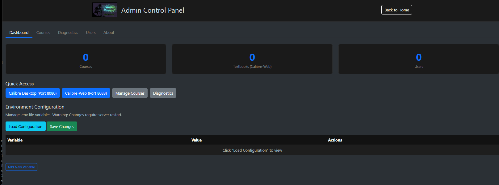

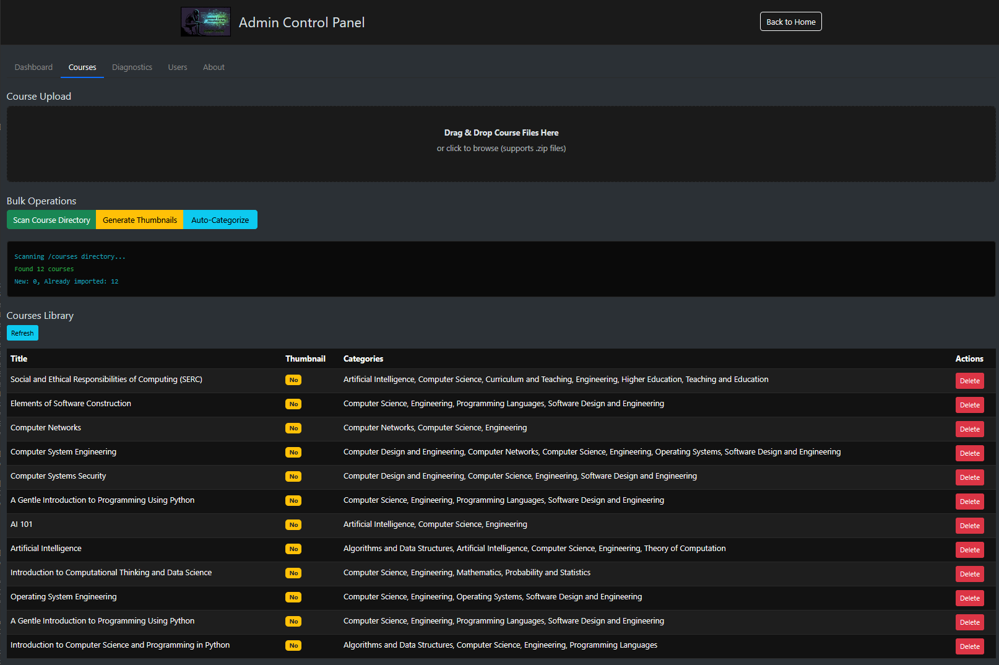

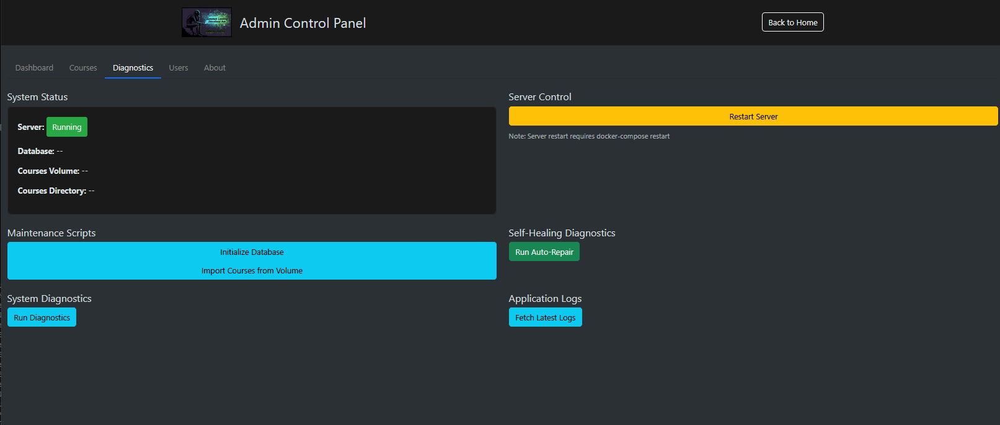

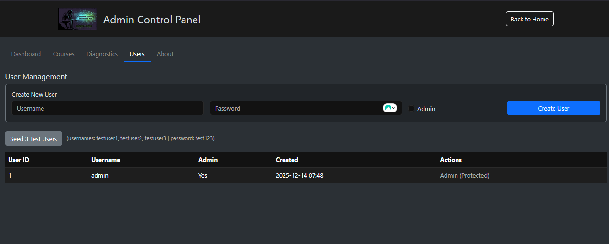

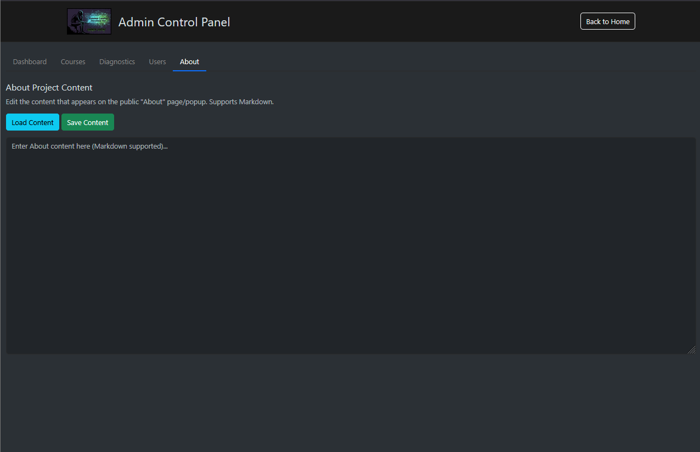

---

## Support and documentation

- Issues and bug reports: [GitHub Issues](https://github.com/allie-rae-devop/GLEH/issues)
- Full deployment guide: [docker/DOCKER_DEPLOYMENT.md](docker/DOCKER_DEPLOYMENT.md)
- Admin panel documentation: [docs/admin-panel-readme.md](docs/admin-panel-readme.md)

---

## License

See [LICENSE](LICENSE) for details.

Built with Flask, Docker, PostgreSQL, and Calibre. Implementation written with Claude Code.
